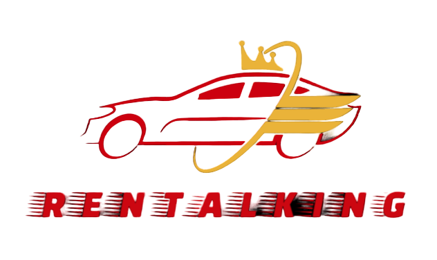

# RentalKing - Rental Car Buying Website



RentalKing is a React app that serves as a rental car buying website, offering both gas and electric car options. This project utilizes MongoDB Atlas as the database solution and is deployed on the Railway cloud platform.

## Table of Contents

- [Features](#features)
- [Requirements](#requirements)
- [Installation](#installation)
- [Configuration](#configuration)
- [Usage](#usage)
- [Deployment](#deployment)
- [Contributing](#contributing)
- [License](#license)

## Features

- Browse and search for rental cars
- Filter cars by type (gas or electric)
- View car details, including specifications and pricing
- Add cars to the cart and proceed to checkout
- Manage user authentication and authorization
- User account management (profile, orders, etc.)

## Requirements

Make sure you have the following software installed on your system:

- Node.js (version 14 or higher)
- bun (JavaScript runtime)
- MongoDB Atlas account (for database)
- Railway account (for deployment)

## Installation

1. Clone the repository to your local machine:

```bash
git clone https://github.com/your-username/RentalKing.git
```

2. Change to the project directory:

```bash
cd RentalKing
```

3. Install the dependencies using npm:

```bash
npm install
```

## Configuration

1. MongoDB Atlas

   - Sign up or log in to your MongoDB Atlas account (https://www.mongodb.com/cloud/atlas).
   - Create a new cluster and obtain the connection URI.
   - Replace the `MONGODB_URI` placeholder in the `.env` file with your connection URI.

2. Railway

   - Sign up or log in to your Railway account (https://railway.app/).
   - Connect your GitHub account to Railway.
   - Create a new Railway project.
   - Set the environment variables in the Railway project settings:
     - `MONGODB_URI`: Set it to the connection URI of your MongoDB Atlas cluster.
     - `JWT_SECRET`: Set it to a secret string used for JSON Web Token (JWT) generation.

## Usage

To start the application locally, run the following command:

```bash
bun start
```

Open your browser and visit `http://localhost:8080` to access the RentalKing application.

## Deployment

RentalKing can be deployed to the Railway cloud platform using the following steps:

1. Commit your changes to a Git branch.

2. Push the branch to your GitHub repository.

3. Go to your Railway project dashboard and select your repository.

4. Configure the settings for the deployment (branch, environment variables, etc.).

5. Deploy the application to Railway.

6. Once the deployment is complete, you will receive a URL where the app is hosted.

## Contributing

Contributions are welcome! If you find any bugs or want to enhance the project, feel free to create a pull request with your changes.

## License

The RentalKing project is licensed under the [MIT License](LICENSE).
